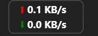

# NetSpeedMonitor


**NetSpeedMonitor** is a lightweight, always-on-top network speed monitor for Windows. It floats as a compact transparent strip and shows real-time upload and download speed with low overhead, persistent positioning, configurable styling, and efficient long-term usage tracking.



> ## Features

- **Compact Overlay:** Slim two-row upload and download readout designed to sit near the Windows taskbar.
- **Always on Top:** Keeps network speed visible while you work, browse, game, or test downloads.
- **Configurable Display:** Tune size, opacity, border, fonts, colors, icons, units, spacing, and update frequency.
- **Smart Positioning:** Drag the monitor anywhere and it remembers its position between sessions.
- **Network Usage Stats:** Tracks session, hourly, daily, and total data usage with slow disk flushing to reduce unnecessary writes.
- **Adapter Control:** Supports automatic, all-adapter, and manual adapter selection for Wi-Fi, Ethernet, and VPN workflows.
- **Low Overhead:** Built with WPF and native Windows network counters. No bundled telemetry, no background services.

## Tech Stack

- **Language:** C#
- **Framework:** WPF (Windows Presentation Foundation)
- **Target:** .NET 7.0 for Windows
- **Runtime APIs:** `System.Net.NetworkInformation`, Windows IP Helper APIs, WPF Dispatcher timers

## Build from Source

1. Clone the repository:
   ```powershell
   git clone https://github.com/Offset0x/NetSpeedMonitor.git
   cd NetSpeedMonitor
   ```

2. Build:
   ```powershell
   dotnet build -c Release
   ```

3. Run:
   ```powershell
   dotnet run -c Release
   ```

## Usage

- Left-click and drag the strip to reposition it.
- Right-click to open settings, view usage statistics, reset counters, or exit.
- Use the settings window to adjust units, colors, opacity, adapter mode, and stats retention.

## Notes

Runtime settings and usage data are generated locally as `config.json` and `netstats.json`. These files are intentionally ignored by git so every machine can keep its own layout and counters.
